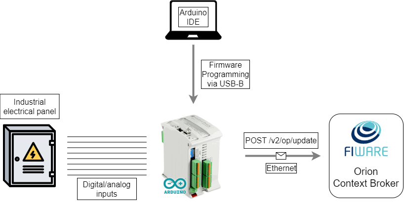

A general schematic of the architecture can be seen below:

    

- **Digital/analog inputs:** the M-DUINO resides in the electrical panel where it's linked to the desired digital or analog inputs. Each input goes into one of the pins. These pins will then be managed with the firmware.

- **Arduino IDE:** open-source Arduino Software where the firmware is developed, configured and uploaded onto the board. USB-B is the standard for both firmware uploading and serial communication with the board.

- **Orion Context Broker (OCB):** the data collected by the M-DUINO is forwarded towards an OCB which holds this information as an entity. This is achieved via the NGSIv2 REST API. OCB then acts as a central hub where other applications can manipalute its context information.
